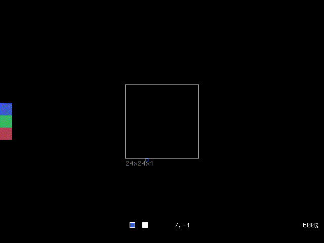

# *rx* is a modern and minimalist pixel editor.

<nav>
  💻 <a href="#install">install</a>
  📖 <a href="/guide.html">guide</a>
   <a href="https://github.com/cloudhead/rx">source</a>
  💚 <a href="#support">support</a>
  🧙 <a href="#community">community</a>
</nav>

*rx* is an *extensible*, modern and minimalist pixel editor, designed with great
care and love for artists and hackers. It was conceived to have
as little UI as possible, and instead focus on the *work*.

To achieve this, `rx` takes inspiration from [vi][0]'s modal nature and is
built around a *command system*, unique to tools of its kind.

[0]: https://en.wikipedia.org/wiki/Vi

## get started

*rx* can be installed on Linux, macOS and Windows.  See the [install](#install)
section for further details. If you'd prefer to download a pre-built binary, see
the section on [binary releases](#binaries).

* To learn how to *use* rx, read the [guide][guide].
* To learn how rx *works*, browse the [source][source].

## community 🧙

The *rx* community can be found on [discord](https://discord.com/invite/VtjUpj8n).
Come hang out, share your work or discuss ideas around the editor.

## goals

* **Minimal.** Small, hackable codebase and dependency footprint. The editor
  should only include what is necessary.

* **Beautiful.** Clean, modern aesthetics with a strong attention to detail.

* **Snappy.** No perceptible input lag. Update and paint time should be
  less than `8ms` on commodity hardware at 1920x1080.

* **Configurable & extensible.** Artists should be in control of their workflow.
  If it isn't built-in, it should be easy to extend the editor's functionality.

* **Resource efficient.** Battery drain should be minimized. Memory footprint should
  be small.

## features

  * Built-in sprite animation support, with live preview.
  * Work with multiple files simultaneously.
  * Extensible command system.
  * Configurable with a simple text-based language.
  * HiDPI support.
  * UI scaling.
  * Undo/redo any edit.
  * Animated GIF output.
  * Multi-brush / synchronous editing.
  * Brush filtering a.k.a. "pixel-perfect" mode.
  * Visual mode for pixel manipulation.

## system requirements

`rx` currently supports **Linux**, **macOS** and **Windows** with OpenGL 3.3 or
later.

## install

*The following is to install from source. If you'd like to download a pre-built
binary, see the [next](#binaries) section*.

With [cargo][cargo] and [cmake][cmake] installed, run:

    cargo install \
        --git https://github.com/cloudhead/rx \
        --tag v0.4.0

This will download the latest *stable* release of `rx` and install it under
`~/.cargo/bin/rx`.  If you prefer a different install location, you can specify
it via the `--root <prefix>` flag, where `<prefix>` is for example
`/usr/local`.

[cargo]: https://crates.io/install
[cmake]: https://cmake.org/download/

On **macOS**, **Xcode** and the **Xcode Command Line Tools** are required.  The
latter can be obtained by running `xcode-select --install`. CMake can be
installed with `brew install cmake`.

## binary releases

At the moment, only *Linux* binaries are available.

### linux

> [rx-0.4.0-x86_64.AppImage][app-linux]

This is an [AppImage][appimage], a self-contained application. Before opening
it, make it executable with `chmod +x`. You can then double-click it or execute
it directly from your terminal.

Feel free to rename it to `rx` and move it to your `PATH`. To uninstall,
simply delete the file.

[app-linux]: https://github.com/cloudhead/rx/releases/download/v0.4.0/rx-0.4.0-x86_64.AppImage
[appimage]: https://appimage.org/

## support *rx* 💚

If you find this project useful, consider [supporting](https://cloudhead.io/donate) it.

## about

*rx* was created in 2019 by [cloudhead](https://cloudhead.io) and implemented
in the [rust][1] programming language, using the [rgx][2] library by
the same author.

[1]: https://rust-lang.org
[2]: https://github.com/cloudhead/rgx

*rx* is free software, licensed under the **GPL**. See the `LICENSE` file in
the code repository for more details.

If you encounter a bug, please open an issue on the [tracker][tracker], or
send an email to <rx@cloudhead.io>.

[tracker]: https://github.com/cloudhead/rx/issues

&copy; 2019 Alexis Sellier

[guide]: guide.html
[source]: https://github.com/cloudhead/rx
